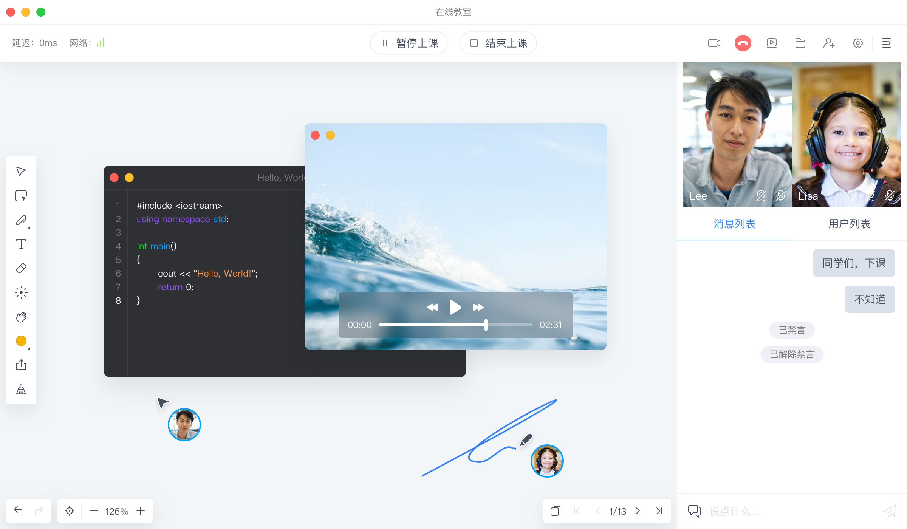

<div align="center">
    
</div>

<div align="center">
    
    
    
    <a target="_blank" href="https://github.com/netless-io/flat/issues?q=is%3Aissue+is%3Aopen+label%3A%22good+first+issue%22">
        
    </a>
    <br>
    <a target="_blank" href="https://twitter.com/AgoraFlat">
    
    </a>
    <a target="_blank" href="https://github.com/netless-io/flat/issues/926">
        
    </a>
</div>

<div align="center">
    <h1>Agora Flat</h1>
    <p>项目 flat 是 <a href="https://flat.whiteboard.agora.io/">Agora Flat</a> 开源教室的 Web 端、Windows 客户端与 macOS 客户端。</p>
    
</div>

## 产品体验

- [快速体验 Flat Web][flat-web]
- [应用 下载地址][flat-homepage]
- [Flat 组件库 Storybook][flat-storybook]

## 相关项目

- [Flat 安卓][flat-android]
- [Flat 服务端][flat-server]
- [Flat 展示页][flat-homepage]

## 特性

- 实时交互
    - 多功能互动白板
    - 实时音视频（RTC）通讯
    - 即时消息（RTM）聊天
- 帐户系统
    - 微信登陆
    - GitHub 登陆
- 房间管理
    - 加入、创建、预定房间
    - 支持周期性房间
- 课堂录制回放
    - 白板信令回放
    - 音视频云录制回放
    - 群聊信令回放
- 多媒体课件云盘
- 屏幕共享

## 本地开发

在 Flat 中 UI 逻辑与业务逻辑分开开发。可以通过 [Storybook](#storybook) 快速查看与开发部分 UI。

### 安装

```shell
yarn run bootstrap
```

### 开发模式

```shell
yarn run start
```

### 打包可执行文件

- 项目根执行 `yarn ship` 将根据当前系统打包。
- 或者项目根执行 `yarn ship:mac` 或 `yarn ship:win` 可针对相应系统打包。

### Storybook

部分 Flat 组件 UI 可通过 Storybook 快速查看与开发（[线上地址][flat-storybook]）。

- 项目根执行 `yarn run storybook` 可在本地运行 Storybook。

## 文档

- [发布版本说明](docs/releases)
- [环境变量值参考](docs/env/README-zh.md)
- [调试 Flat](docs/debugging/README-zh.md)

## 代码贡献者

感谢所有为 Flat 做出过贡献的人！

<a href="https://github.com/netless-io/flat/graphs/contributors"></a>

## 免责声明

本项目仅用于学习和交流使用，请遵守所在国的法律法规，切勿用于涉及政治、宗教、色情、犯罪等领域，一切违法后果请自负。

## 许可证

版权所有 Agora, Inc. 保留所有权利。

使用 [MIT 许可证](LICENSE)

当使用 Flat 或其他 GitHub 徽标时，请务必遵循 [GitHub 徽标指南][github-logo]。

[flat-homepage]: https://flat.whiteboard.agora.io/#download

[flat-web]: https://flat-web.whiteboard.agora.io/

[flat-server]: https://github.com/netless-io/flat-server

[flat-android]: https://github.com/netless-io/flat-android

[flat-storybook]: https://netless-io.github.io/flat/

[github-logo]: https://github.com/logos
