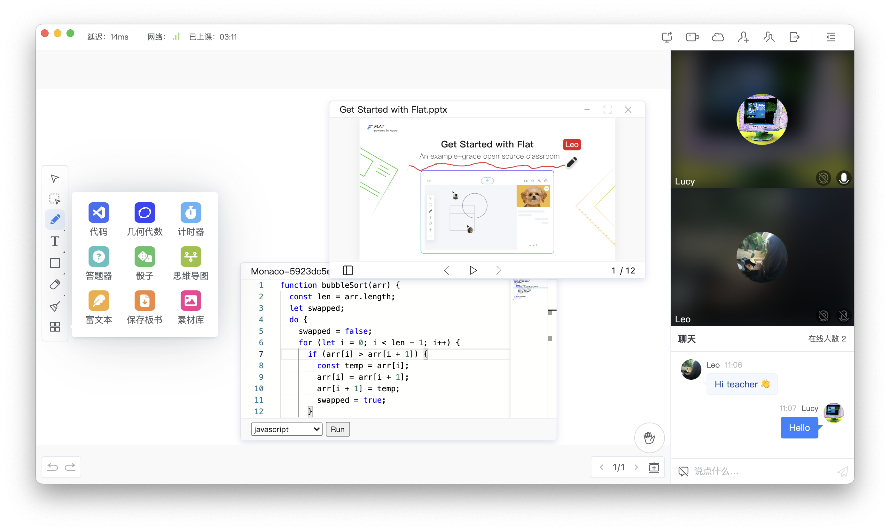

<div align="center">
    
</div>

<div align="center">
    
    
    
    <a target="_blank" href="https://github.com/netless-io/flat/issues?q=is%3Aissue+is%3Aopen+label%3A%22good+first+issue%22">
        
    </a>
</div>

<div align="center">
    <h1>Agora Flat</h1>
    <p>项目 flat 是 <a href="https://flat.whiteboard.agora.io/">Agora Flat</a> 开源教室的 Web 端、Windows 客户端与 macOS 客户端。</p>
    
</div>

## 产品体验

-   [快速体验 Flat Web][flat-web]
-   [APP 下载地址][flat-homepage]
-   [Flat 组件库 Storybook][flat-storybook]

## 特性

-   前后端完全开源
    -   [x] [Flat Web][flat-web]
    -   [x] Flat 桌面端（[Windows][flat-homepage] 与 [macOS][flat-homepage]）
    -   [x] [Flat Android][flat-android]
    -   [x] [Flat Server][flat-server] 服务器
-   多场景课堂
    -   [x] 大班课
    -   [x] 小班课
    -   [x] 一对一
-   实时交互
    -   [x] 多功能互动白板
    -   [x] 实时音视频（RTC）通讯
    -   [x] 即时消息（RTM）聊天
    -   [x] 举手上麦发言
-   帐户系统
    -   [x] 微信登陆
    -   [x] GitHub 登陆
    -   [ ] 谷歌登陆
-   房间管理
    -   [x] 加入、创建、预定房间
    -   [x] 支持周期性房间
    -   [x] 查看历史房间
-   课堂录制回放
    -   [x] 白板信令回放
    -   [x] 音视频云录制回放
    -   [x] 群聊信令回放
-   [x] 多媒体课件云盘
-   [x] 设备检测
-   [x] 自动检查更新

## 本地开发

在 Flat 中 UI 逻辑与业务逻辑分开开发。可通过 [开发模式](#开发模式) 跑起项目，也可以通过 [Storybook](#storybook) 快速查看与开发部分 UI。

### 安装

在项目根目录执行：

```shell
yarn run bootstrap
```

### 开发模式

在项目根目录执行：

```shell
yarn run start
```

### 打包可执行文件

-   项目根执行 `yarn ship` 将根据当前系统打包。
-   或者项目根执行 `yarn ship:mac` 或 `yarn ship:win` 可针对相应系统打包。

### Storybook

部分 Flat 组件 UI 可通过 Storybook 快速查看与开发（[线上地址][flat-storybook]）。

-   项目根执行 `yarn run storybook` 可在本地运行 Storybook。

## 文档

* [环境变量值参考](docs/env/README-zh.md)

## 代码贡献者

感谢所有为 Flat 做出过贡献的人！

<a href="https://github.com/netless-io/flat/graphs/contributors"></a>

[flat-homepage]: https://flat.whiteboard.agora.io/#download
[flat-web]: https://flat-web.whiteboard.agora.io/
[flat-server]: https://github.com/netless-io/flat-server
[flat-android]: https://github.com/netless-io/flat-android
[flat-storybook]: https://netless-io.github.io/flat/
