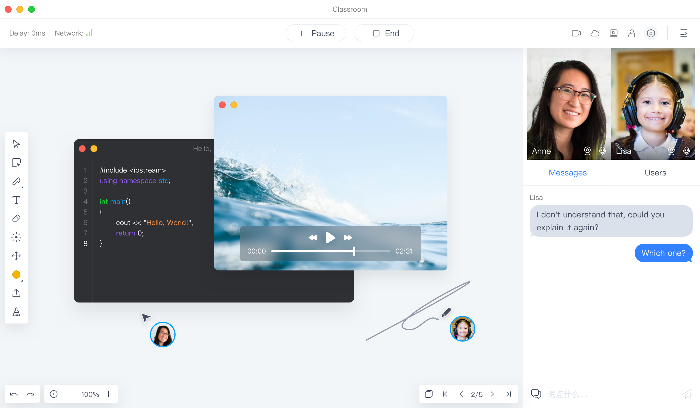

<p align="center">
    
</p>

<div align="center">
    
    
    
    <a target="_blank" href="https://github.com/netless-io/flat/issues?q=is%3Aissue+is%3Aopen+label%3A%22good+first+issue%22">
        
    </a>
    <br>
    <a target="_blank" href="https://twitter.com/AgoraFlat">
    
    </a>
    <a target="_blank" href="https://github.com/netless-io/flat/issues/926">
        
    </a>
</div>

<div align="center">
    <h1>Agora Flat</h1>
    <p>Project flat is the Web, Windows and macOS client of <a href="https://flat.agora.io/">Agora Flat</a> open source classroom.</p>
    <p><a href="./docs/readme/README-zh.md">中文</a></p>
    
</div>

## Features

-   Real-time interaction
    -   Multifunctional interactive whiteboard
    -   Real-time video/audio chat (RTC)
    -   Real-time messaging (RTM)
-   Login via
    -   GitHub
    -   WeChat
-   Classroom management
    -   Join, create and schedule classrooms
    -   Support periodic rooms
-   Classroom recording and replaying
    -   Whiteboard replaying
    -   Cloud recording for video and audio
    -   Messaging replaying
-   Cloud Storage for multi-media courseware
-   Screen sharing

## Quickstart

You can build and run the Flat client without a server. This repository includes the following projects:

-   [Flat Electron client](./desktop) is an Electron implementation of Flat client.
-   [Flat Web client](./web) is a web implementation of Flat client.

### Installation

> If you don't have pnpm installed:
>
> ```bash
> npm i -g pnpm
> ```

Clone or fork this project, at project root run:

```bash
pnpm i
```

### Build and run Flat Electron client

Run the following commands at the root of the repository to build and run Flat Electron client.

```shell
pnpm start
```

You can use one of the following methods to package your executable:

-   Run `pnpm ship` at project root to package based on current system.
-   Alternatively, run `pnpm ship:mac` or `pnpm ship:win` at project root to package for a specified system.

### Build and run Flat Web client

Run the following command at the root of the repository to build and run Flat web client.

```shell
pnpm start:web
```

Alternatively, run the following command:

```shell
cd ./web/flat-web/ && pnpm start
```

UI and business logic are separated in Flat. You can view and develop Flat components UI via Storybook. You can either visit the ([Online address][flat-storybook]) or run `pnpm storybook` at the root of the repository to run Storybook locally.

## References

-   [Release Version Description](docs/releases)
-   [Environment Variables Reference](docs/env/README.md)
-   [Debugging Flat](docs/debugging/README.md)

## Related Projects

-   [Flat Android client][flat-android]
-   [Flat Server][flat-server]
-   [Flat Website HomePage][flat-homepage]

## Contributing

Writing code is great, but there are many other ways to make meaningful contributions to the project:

-   [Improve documentation](CONTRIBUTING.md#improve-documentation)
-   [Improve issues](CONTRIBUTING.md#improve-issues)
-   [Give feedback on issues](CONTRIBUTING.md#give-feedback-on-issues)

For more info about how to contribute, see [CONTRIBUTING.md](CONTRIBUTING.md)

## Code Contributors

Thank you to all the people who already contributed to Flat!

<a href="https://github.com/netless-io/flat/graphs/contributors"></a>

## Disclaimer

You may use Flat for commercial purposes but please note that we do not accept customizational commercial requirements and deployment supports. Nor do we offer customer supports for commercial usage. Please head to [Flexible Classroom](https://www.agora.io/en/products/flexible-classroom) for such requirements.

## License

Copyright © Agora Corporation. All rights reserved.

Licensed under the [MIT license](LICENSE).

When using the Flat or other GitHub logos, be sure to follow the [GitHub logo guidelines][github-logo].

[flat-homepage]: https://flat.agora.io/#download
[flat-web]: https://web.flat.agora.io/
[flat-server]: https://github.com/netless-io/flat-server
[flat-android]: https://github.com/netless-io/flat-android
[flat-storybook]: https://netless-io.github.io/flat/
[github-logo]: https://github.com/logos
