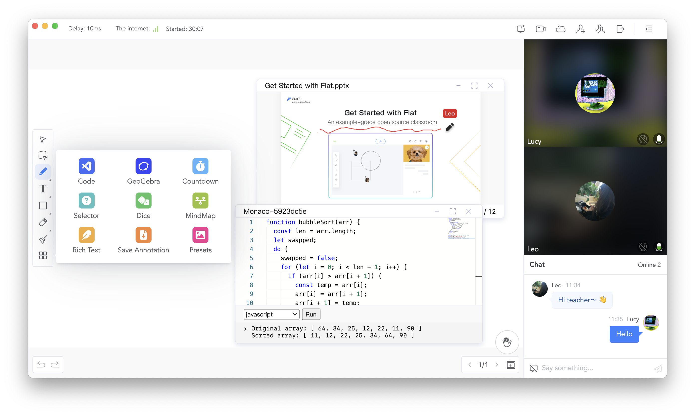

<div align="center">
    
</div>

<div align="center">
    
    
    
    <a target="_blank" href="https://github.com/netless-io/flat/issues?q=is%3Aissue+is%3Aopen+label%3A%22good+first+issue%22">
        
    </a>
</div>

<div align="center">
    <h1>Agora Flat</h1>
    <p>Project flat is the Web, Windows and macOS client of <a href="https://flat.whiteboard.agora.io/en/">Agora Flat</a> open source classroom.</p>
    <p><a href="./README-zh.md">中文</a></p>
    
</div>

## Try it now

-   [Start using Flat Web][flat-web]
-   [Download artifact][flat-homepage]
-   [Flat Components Storybook][flat-storybook]

## Features

-   Open sourced front-end and back-end
    -   [x] [Flat Web][flat-web]
    -   [x] Flat Desktop ([Windows][flat-homepage] and [macOS][flat-homepage])
    -   [x] [Flat Android][flat-android]
    -   [x] [Flat Server][flat-server]
-   Optimized teaching experience
    -   [x] Big class
    -   [x] Small class
    -   [x] One on one
-   Real-time interaction
    -   [x] Multifunctional interactive whiteboard
    -   [x] Real-time video/audio chat(RTC)
    -   [x] Real-time messaging(RTM)
    -   [x] Participant hand raising
-   Login via
    -   [x] Wechat
    -   [x] GitHub
    -   [ ] Google
-   Classroom management
    -   [x] Join, create and schedule classrooms
    -   [x] Support periodic rooms
    -   [x] View room history
-   Classroom recording and replaying
    -   [x] Whiteboard replaying
    -   [x] Cloud recording for video and audio
    -   [x] Messaging replaying
-   [x] Cloud Storage for multi-media courseware
-   [x] Device self-check
-   [x] Auto Updater

## Development

UI and business logic are separated in Flat. You can run flat with [development mode](#development-mode) or quickly develop UI via [Storybook](#storybook).

### Installation

At project root:

```shell
yarn run bootstrap
```

### Development Mode

At project root:

```shell
yarn run start
```

### Package Executable

-   Run `yarn ship` at project root to package base on current system type.
-   Or run `yarn ship:mac` or `yarn ship:win` at project root to package for the specified system.

## Storybook

Many Flat components UI can be quickly viewed and developed via Storybook ([Online address][flat-storybook]).

-   Run `yarn run storybook` at project root to run Storybook locally.

## Documents

* [Environment Variables Reference](docs/env/README.md)

## Code Contributors

Thank you to all the people who already contributed to Flat!

<a href="https://github.com/netless-io/flat/graphs/contributors"></a>

[flat-homepage]: https://flat.whiteboard.agora.io/en/#download
[flat-web]: https://flat-web.whiteboard.agora.io/
[flat-server]: https://github.com/netless-io/flat-server
[flat-android]: https://github.com/netless-io/flat-android
[flat-storybook]: https://netless-io.github.io/flat/
