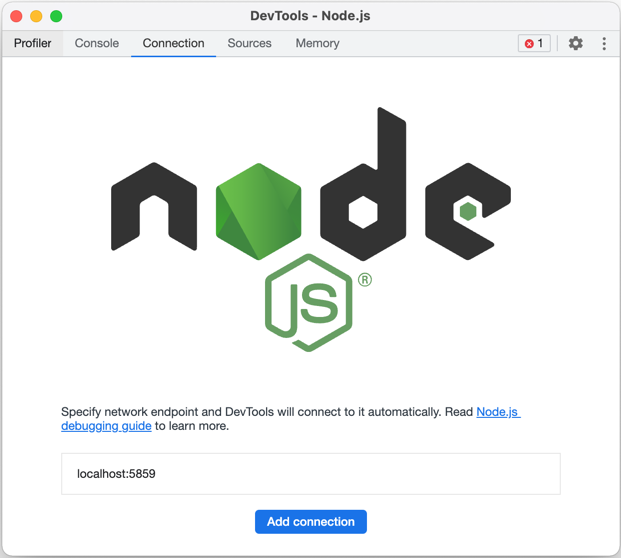

## Electron - 主进程 (desktop/main-app)

为了方便调试，我们给预留的 _Debug_ 配置，都设置了: `--enable-logging` 和 `--inspect=5859`

* `--enable-logging`: 这个选项将会传递给 _Electron_，传递后 _Electron_ 将会把自身的 `debug` 日志打印到当前控制台
* `--inspect=5859`: 如果你更喜欢使用 _Chrome DevTools_ 进行调试的话，那么你可以在 `chrome://inspect` 监听此端口进行调试

### WebStorm

我们已经在 _WebStorm_ 里帮你设置好了 _Debug Main_ Configurations，你可以直接使用它来进行 _Debug_

> 需要注意的是，你应该选择 `Debug` 按钮，而非 `Run` 按钮，就像下图所示:

> 

### vscode

我们也为了 _vscode_ 预留了配置好的 _Debug Main_ configurations，你可以在 _vscode_ 的侧边栏进行 _Debug_

如图所示:

### 额外说明

### `--enable-logging` 参数

目前我们所使用的 `Electron` 版本并不支持设置日志的输出位置，因为这个特性在 `Electron v14.0.0` 才被支持，有关这一点可以参考: [electron/electron#25089](https://github.com/electron/electron/pull/25089)

未来当 _Flat_ 升级 `Electron` 版本到 _14.0.0_ 或者更高时，我们将进行支持

### `--inspect=5859` 参数

如果你想使用 `Chrome DevTools` 进行调试，可以参考下面的流程:

首先你要先确保你已经启动了 _Debug_，同时也在启动前设置了断点。

当 _Debug_ 启动后，_Node.js_ 会去监听 `5859` 端口。此时在 `Chrome` 地址栏中打开: `chrome://inspect`，就像下面这样

此时点击: _Open dedicated DevTools for Node_，会出现一个 `DevTools` 的窗口

此时你的页面可能和我不一致，请不用担心。点击 _Add connection_，在输入框中输入: `localhost:5859`，再点击 _Add_ 就可以进行调试了。就像下面这样：

### `Watch` 不一致问题

我们在调试过程中，经常需要使用 `Watch` 的功能，但是需要注意的是，你所 _Watch_ 的 变量可能并不存在。因为 _Debug_ 所执行的代码是编译后的，所以变量名有可能会被重写。

但好消息是，目前发现这种变量重写只影响: `import` 语句，例如:

* `import runtime from "./Runtime"` => `Runtime_1`
* `import { app } from "electron""` => `electron_1`

用一个截图可以更加清楚的描述这个问题：

造成这个问题的原因是因为 `tsc` 的编译，目前还没有更好的办法去解决，只能在操作时注意。

> 即使使用 `ts-node` 作为运行时，也是一样的。因为 `ts-node` 本质也就是动态的去做 `tsc`
