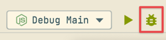

## Electron - Main Process (desktop/main-app)

To facilitate debugging, we set the reserved _Debug_ configuration with: `--enable-logging` and `--inspect=5859`

* `--enable-logging`: This option will be passed to _Electron_, which will then print its own `debug` logs to the current console
* `--inspect=5859`: If you prefer to use _Chrome DevTools_ for debugging, then you can listen to this port at `chrome://inspect` for debugging

### WebStorm

We've set up the _Debug Main_ Configurations in _WebStorm_ for you, and you can use it directly to do the _Debug_

> Note that you should select the `Debug` button, not the `Run` button, as shown in the image below:

> 

### vscode

We also set aside configured _Debug Main_ configurations for _vscode_, which you can do in the _Debug_ sidebar of _vscode_.

As shown in the picture:

### Additional Notes

### `--enable-logging` param

The version of `Electron` we are currently using does not support setting the output location of logs, as this feature was not supported until `Electron v14.0.0`, for which see: [electron/electron#25089](https://github.com/electron/electron/pull/25089)

In the future, when _Flat_ upgrades `Electron` to _14.0.0_ or higher, we will support

### `--inspect=5859` param

If you want to use `Chrome DevTools` for debugging, you can refer to the following procedure:

First you have to make sure you have started _Debug_ and also set a breakpoint before starting it.

When _Debug_ starts, _Node.js_ will listen to port `5859`. In this case, open: `chrome://inspect` in the `Chrome` address bar, like this

Click: _Open dedicated DevTools for Node_, a `DevTools` window will appear

Your page may not match mine at this point, please don't worry. Click _Add connection_, enter: `localhost:5859` in the input box, then click _Add_ and you are ready to debug. It looks like the following:

### `Watch` inconsistency issues

We often need to use the `Watch` function during debugging, but it should be noted that what you _Watch_ The variable may not exist. Because the code executed by _Debug_ is compiled, it is possible that variable names will be overwritten.

But the good news is that it has been found that such variable overrides only affect: `import` statements such as :

* `import runtime from "./Runtime"` => `Runtime_1`
* `import { app } from "electron""` => `electron_1`

A screenshot can describe the problem more clearly:

This problem is caused by the compilation of `tsc`', at present, there is no better way to solve it. We can only pay attention to it during operation.

> This is true even if you use `ts-node` as a runtime. Because `ts-node` is essentially a dynamic way to do `tsc` as well.
